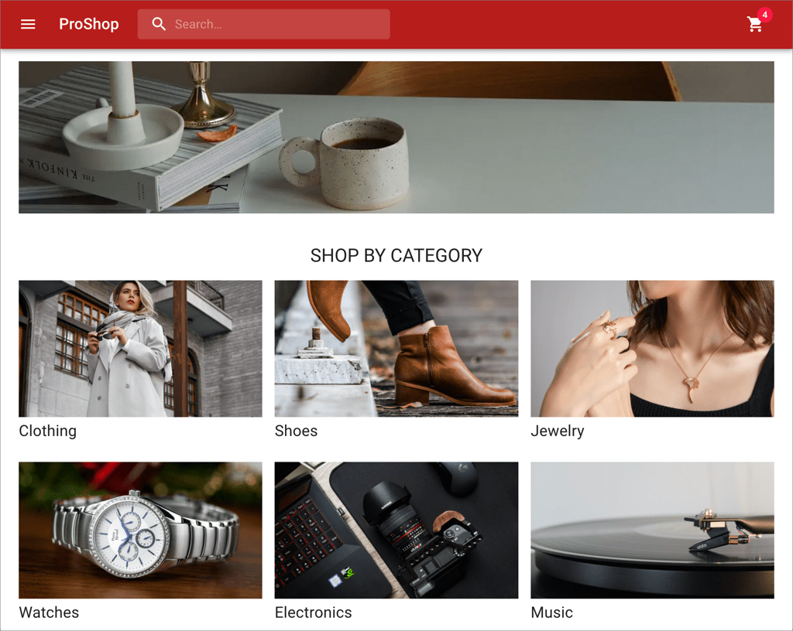

# ProShop Turbo

A sample eCommerce app to show best practices in web development using
Turborepo.



## Tech Stack

- [Turborepo](https://turborepo.org/)
- [TypeScript](https://www.typescriptlang.org/)
- [React](https://reactjs.org/)
- [Next.js](https://nextjs.org/)
- [GraphQL](https://graphql.org/)
- [Apollo GraphQL](https://www.apollographql.com/)
- [Material UI](https://mui.com/)

## Architecture

The ProShop app consists of two micro-frontends which are separate web apps
deployed at two different ports:

1. Catalog App: Displays the product catalog and allows the user to add products
   to the cart.
2. Cart App: Displays the cart and allows the user to manage it, i.e. add,
   delete and update items). Once the user is happy with the cart, they can
   place an order. (Note that this is a very simplified checkout process - there
   is no provision for collecting shipping and/or payment information.)

- Both micro-frontends talk to a GraphQL API called the `proshop-api`.
- Both micro-frontends share a common UI library called `ui`.

## Development Build

Clone a fresh copy of the repo:

```sh
git clone https://github.com/nareshbhatia/proshop-turbo.git
cd proshop-turbo
```

Create environment variables for local development:

1. Create a file called `.env.local` under `/apps/catalog` and add the following
   variable to it.

```
NEXT_PUBLIC_API_URL=http://localhost:8080
```

2. Create another file called `.env.local` under `/apps/cart` and add the same
   variable to it as above. (The two files should be identical.)

> Note: These environment files should not be checked into git. They are already
> added to .gitignore.

Now follow the steps below:

```
npm install
npm run dev
```

Open two browser windows and point them to the following URLs:

1. http://localhost:3001/: Catalog app home page
2. http://localhost:3002/: Cart app home page

> Note: Do not run `npm install` in any of the subdirectories. It will break the
> build. There should be only one `package-lock.json` file in the entire repo
> (at the root).

## Production Build

To build all apps and packages, run the following command:

```
npm install
npm run build
```
